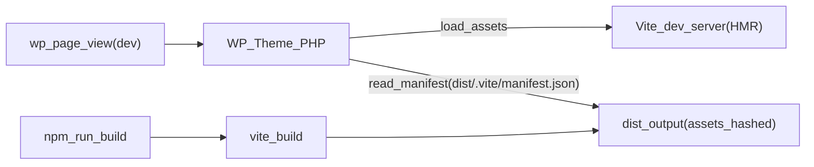

# 構成調査レポート（t2025-12-24vite-wp / WordPress版）

対象リポジトリ: `t2025-12-24vite-wp`  
主な目的: WordPress（クラシックテーマ）用に作り替えた現在の構成と「どのファイルでどう実現しているか」を根拠付きで整理する

---

## 1. 概要

このプロジェクトは **WordPressクラシックテーマ + Vite + Sass** の制作環境です。

- **開発**: WordPressで表示しつつ、CSS/JSは **Vite dev server（HMR）** を参照  
- **本番**: `vite build` で生成された **`dist/.vite/manifest.json`** を参照し、WordPress側で `wp_enqueue_style/script` する

静的サイト前提だった以下は廃止済みです。
- **EJSテンプレ**（`src/ejs/**`）
- **静的HTMLエントリ**（`src/**/*.html`）
- **after-build（HTML後処理）**
- **html-validate**
- **husky（npm依存/script）**

---

## 2. 全体フロー（開発・本番）

ポイント:
- WordPressはPHPテンプレートでHTMLを生成するため、**HTMLをエントリにしない**。
- 代わりに、Viteのエントリは **JS/CSSファイル**（`src/assets/js/main.js`, `src/assets/sass/style.scss`）。

---

## 3. 機能一覧と実現方法（根拠ファイル付き）

### 3.1 WordPressテーマ（クラシック）

**実現箇所**
- `style.css`: テーマヘッダ
- `header.php`, `footer.php`, `index.php`: 最小テンプレ

補足:
- 現状 `wp_nav_menu()` は使用しない方針（空の`<ul>`を固定出力）。

### 3.2 Vite連携（dev/HMR と prod/manifest）

**実現箇所**
- `functions.php`
  - enqueueの入口（Vite dev/prod切替）
  - `script_loader_tag` で `type="module"` を強制付与（devで `import` を扱うため）
- `functions-lib/func-vite.php`
  - dev: `@vite/client` と `src/assets/**` を `localhost:5173` から読み込み
  - prod: `dist/.vite/manifest.json` を読んで `dist/assets/**` を読み込み
  - JS entryに紐づく `css`（例: ライブラリCSS）も prodでenqueue

#### dev / prod の判定方法
判定は `functions-lib/func-vite.php` の `t2025_vite_is_dev()` で行います。

- `functions.php` で `T2025_VITE_DEV_SERVER` を定義（`is_ssl()` に応じて `https://localhost:5173` または `http://localhost:5173`）
- `T2025_VITE_DEV_SERVER/@vite/client` に `wp_remote_head()` で到達確認（短いtimeout）
  - 到達できる: **dev扱い**（Vite dev serverから `@vite/client` と `src/assets/**` を読み込む）
  - 到達できない: **prod扱い**（`dist/.vite/manifest.json` を参照して `dist/assets/**` をenqueue）

### 3.3 SCSS → CSS（Vite経由）

**実現箇所**
- `src/assets/sass/style.scss`: Sassの集約
- `vite.config.js`: `rollupOptions.input` に `style.scss` を登録
- `postcss.config.cjs`: `autoprefixer`, `postcss-sort-media-queries`

**出力**
- `dist/assets/css/style-*.css`: 自作Sass

### 3.4 JSバンドル

**実現箇所**
- `src/assets/js/main.js`: 機能別モジュールをimportして束ねる
- `vite.config.js`: `rollupOptions.input` に `main.js` を登録

**出力**
- `dist/assets/js/main-*.js`
- `dist/assets/css/main-*.css`: JS側がimportするCSS（例: SplideのCSS）

### 3.5 画像・フォントの扱い

- 画像（背景画像等）: `src/assets/images/**` を Sass の `url(...)` 経由で参照し、Viteがビルド対象として解決
- フォント: `src/assets/fonts/**` を `@font-face` で参照し、ビルドで `dist/assets/*.woff2` に出力

補足（`` の画像）:
- `` はCSSの `url(...)` のように参照を辿れないため、`vite build` 時に `src/assets/images/**` を `dist/assets/images/**` へ出力し、`dist/theme-assets.json` を生成してPHPが解決する方式を採用

---

## 4. ディレクトリ構成（要点）

- `header.php` / `footer.php` / `index.php` / `functions.php`: WPクラシックテーマ
- `functions-lib/func-vite.php`: Vite連携（dev/prod切替 + manifest解決）
- `src/assets/`
  - `sass/`: 自作Sass
  - `js/`: 自作JS
  - `images/`: テーマ同梱画像
  - `fonts/`: テーマ同梱フォント（Vite管理）
- `src/public/`: そのまま静的配信したいファイル（例: `vite.svg` 等）
- `dist/`: `vite build` の成果物（hash付きassets + `.vite/manifest.json`）
- `docs/wp-migration.md`: 移行メモ/課題/解消ログ

---

## 5. 変更・拡張ポイント（短く）

- **テンプレ追加**: `front-page.php`, `page.php`, `single.php` 等を追加してWPの表示導線を整備
- **メニュー実装**: `wp_nav_menu` を使わない前提で、ナビの中身をどう供給するか決める（静的/カスタム/ブロック等）
- **画像最適化**: `vite-plugin-imagemin` を残すか撤去するか（WPネイティブ運用との住み分け）

---

## 6. 付録（関連ファイル早見）

- Vite設定: `vite.config.js`
- Vite連携: `functions.php`, `functions-lib/func-vite.php`
- Sass入口: `src/assets/sass/style.scss`
- JS入口: `src/assets/js/main.js`
- 移行ログ: `docs/wp-migration.md`
