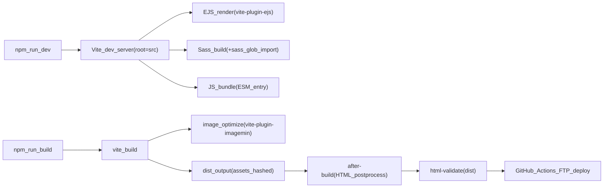

# 構成調査レポート（t2025-10-01vite）

対象リポジトリ: `t2025-10-01vite`  
調査範囲: `node_modules/` と `.git/` を除外した全ファイル（合計 **197** ファイル）  
主な目的: 機能一覧と「どのファイルでどう実現しているか」を根拠付きで整理する

---

## 1. 概要

このテンプレートは **Vite + EJS + Sass** を中心に、ビルド時に **画像最適化（圧縮/WebP生成）** と **HTML後処理（`<picture>`化・`width/height`自動付与）** を行う静的サイトテンプレートです。  
また、開発フローの品質担保として **husky（pre-commit/pre-push）** と **html-validate**、運用として **GitHub Actions（FTPデプロイ + Discord通知）** が用意されています。

- **開発ソース**: `src/`（Viteの`root`）
- **ビルド成果物**: `dist/`
- **プロジェクト設定**: `config/`
- **ビルド後処理**: `scripts/after-build.mjs`
- **CI/CD**: `.github/workflows/deploy.yml`
- **Gitフック**: `.husky/`

---

## 2. 全体フロー（開発〜デプロイ）

ポイント:
- **ビルド手順**は `vite build` の後に `scripts/after-build.mjs` が必ず走ります（`package.json`）。
- **HTML検証**は `dist/` を対象に `html-validate` を実行します（`validate:html`）。

---

## 3. 機能一覧と実現方法（根拠ファイル付き）

### 3.1 EJS → HTML

**実現箇所**
- `vite.config.js`
  - `ViteEjsPlugin({ ...siteConfig, posts })` でEJSへ変数注入
  - `liveReload(["ejs/**/*.ejs"])` でEJS更新時のリロード
- `vite.config.js`
  - `globSync("src/**/*.html", { ignore: ["src/public/**/*.html"] })` を `rollupOptions.input` に登録し、`src/` 配下のHTMLを **複数エントリとして自動ビルド対象** にする
- `src/**/*.html`（例: `src/index.html`, `src/demo/index.html`, `src/contact/index.html`）
  - HTML側でEJSの `include()` を使って共通パーツを組み立て
- `src/ejs/common/*.ejs`（共通: head/header/footer）
- `src/ejs/components/*.ejs`（ページ部品）

**仕組み（最低限）**
- 各ページHTMLで `pages['top']` のようにページ設定を取得し、`page` オブジェクト（title/description/path/root等）を組み立てます。
- `ejsPath`（`config/site.config.js`）を使って、`common/_head.ejs` 等を `include` して構成します。

例（ページHTML側の構成）:
- `src/index.html`
  - `include(ejsPath + 'common/_head.ejs', { page })`
  - `include(ejsPath + 'common/_header.ejs', { page })`
  - `include(ejsPath + 'common/_footer.ejs', { page })`

### 3.2 SCSS → CSS

**実現箇所**
- `src/ejs/common/_head.ejs`
  - `<link rel="stylesheet" href="/assets/sass/style.scss">` を読み込み（Viteがビルド対象として解釈）
- `src/assets/sass/style.scss`
  - `@use "./layouts/**";` のようなglob指定で構成を集約
- `vite.config.js`
  - `vite-plugin-sass-glob-import` により `@use "./**"` のglobを有効化
- `postcss.config.cjs`
  - `autoprefixer`
  - `postcss-sort-media-queries`（`mobile-first`）

**ビルド出力**
- `vite.config.js` の `assetFileNames` により、CSSは `assets/css/[name]-[hash].css`

### 3.3 JSバンドル

**実現箇所**
- `src/ejs/common/_head.ejs`
  - ``
- `src/assets/js/main.js`
  - 機能別モジュール（`_drawer.js`, `_splide-*.js`, `_fadein.js` など）を `import` で束ねる
- `vite.config.js`
  - `entryFileNames` / `chunkFileNames` を `assets/js/[name]-[hash].js` に統一

### 3.4 画像最適化（圧縮、WebP生成）

**実現箇所**
- `vite.config.js`
  - `@vheemstra/vite-plugin-imagemin` を使用
  - 圧縮対象: `include: /\.(png|jpe?g|gif|svg)$/i`
  - JPEG: `imagemin-mozjpeg({ quality: 75, progressive: true })`
  - PNG: `imagemin-pngquant({ quality: [0.65, 0.8], speed: 3 })`
  - GIF: `imagemin-gifsicle({ optimizationLevel: 2 })`
  - SVG: `imagemin-svgo()`
  - WebP生成: `makeWebp`（jpg/png/gif→webp、`skipIfLargerThan: "optimized"`）

**ビルド出力（画像）**
- `vite.config.js` の `assetFileNames` で、画像は `assets/images/[name]-[hash][extname]`

補足:
- READMEに「AVIF生成は準備中」とあり、`scripts/after-build.mjs` 側はAVIFも候補探索しますが、現状 `vite.config.js` ではAVIF生成設定は入っていません（“存在すれば対応する”構成）。

### 3.5 width/height自動生成 + WebP配信用タグ挿入（after-build）

**実現箇所**
- `scripts/after-build.mjs`

**対象**
- `dist/` 配下の `**/*.html` を再帰走査して処理

**処理内容（要点）**
- `` を対象に、元画像の実寸を `sharp(...).metadata()` で取得し `width/height` を付与
- `dist/` にWebP/AVIFが存在する場合:
  - `` を `<picture>` でラップし、`<source type="image/webp">` / `<source type="image/avif">` を自動挿入
  - 既に `<picture>` の場合は **壊さず**、不足する `<source>` だけ補完（art-direction用の`media`も維持）
- 最後に `js-beautify` でHTML全体を整形

**スキップ条件**
- `http(s)://` の外部URL、`data:`、SVGなどは対象外（主にラスタ画像の最適化を想定）

### 3.6 バリデーションチェック（html-validate, husky）

**実現箇所**
- `package.json`
  - `validate:html`: `html-validate dist/`
  - `validate:build`: `npm run build && npm run validate:html`
  - `prepare`: `husky`
- `.htmlvalidate.json`
  - `extends: ["html-validate:recommended"]` + 独自ルール調整
- `.husky/pre-commit`
  - `npm run build:only`（コミット前にビルドだけ通す）
- `.husky/pre-push`
  - `npm run validate:build`（プッシュ前にビルド+HTML検証）

### 3.7 ページ情報の一元管理（site.config.js）

**実現箇所**
- `config/site.config.js`
  - `pages` オブジェクトで、各ページの `label/root/path/title/description/...` を集約
  - `headerExcludePages` / `drawerExcludePages` など「表示除外」設定
  - `ejsPath`, `domain`, `titleSeparator` など共通設定
- `config/utils.js`
  - `isExcluded(key, excludePages)`（`demo*` や `demo[A-Z]*` のようなパターンを解釈）
- `vite.config.js`
  - `ViteEjsPlugin({ ...siteConfig, posts })` でEJSへ注入

**利用例（テンプレ側）**
- `src/ejs/common/_header.ejs`
  - `Object.entries(pages)` をループしてヘッダ/ドロワーメニューを生成
  - `isExcluded(key, headerExcludePages)` 等で除外制御

### 3.8 自動デプロイ（GitHub Actions）

**実現箇所**
- `.github/workflows/deploy.yml`

**トリガー**
- `push`（`main`/`master`）
- `pull_request`（`main`/`master`）
- `workflow_dispatch`（手動実行）: `deploy_to_production` 入力あり

**処理フロー**
- `actions/checkout@v4`
- `actions/setup-node@v4`（Node 20、npmキャッシュ）
- `npm ci`
- `npm run build`
- FTPデプロイ（`SamKirkland/FTP-Deploy-Action@v4.3.4`）
  - push: テスト環境へ
  - PR: PRテスト環境へ
  - 手動: 本番へ（`deploy_to_production: true` のとき）
- Discord通知（`Ilshidur/action-discord@master`）: 成功/失敗で分岐

**必要Secrets（最低限）**
- `FTP_SERVER`
- `FTP_USERNAME`
- `FTP_PASSWORD`
- `TEST_URL`
- `DISCORD_WEBHOOK`

### 3.9 demoページ

**実現箇所**
- `src/demo/**/index.html`（例: `src/demo/demo-accordion/index.html`）
  - `const key = 'demoAccordion'` のように `pages` のキーを指定してページ情報を参照
- `src/ejs/components/_p-demo.ejs`
  - `pages` から `demo` で始まるキーを抽出してデモ一覧を自動生成

### 3.10 npm scripts

**定義**
- `package.json`

**一覧（用途別）**
- 開発:
  - `dev`: `vite`
- ビルド:
  - `build`: `vite build && node scripts/after-build.mjs`（本番ビルド + HTML後処理）
  - `build:only`: `vite build`（後処理なし）
- プレビュー:
  - `preview`: `vite preview`
  - `build:preview`: `npm run build && npm run preview`
- 掃除:
  - `clean`: `dist`, `src/.vite`, `src/.img` 削除
  - `clean:all`: `clean` + `node_modules` + `package-lock.json` も削除
  - `reinstall`: `clean:all` 後に `npm install`
- 検証:
  - `validate:html`: `html-validate dist/`
  - `validate:build`: `build` → `validate:html`
- Git hooks:
  - `prepare`: `husky`

---

## 4. ディレクトリ構成（要点）

- `src/`: 開発ルート（Vite `root`）
  - `index.html`, `contact/index.html`, `demo/**/index.html` などページ実体（EJS includeを含む）
  - `ejs/`: 共通・部品（`common/`, `components/`, `data/`）
  - `assets/`: `sass/`, `js/`, `images/`
  - `public/`: 静的コピー（Viteの`publicDir`。`root=src` のため `src/public` が使われる）
    - 例: `favicon.ico`, `fonts/`, `MailForm01_utf8/mail.php` 等
- `dist/`: ビルド生成物（最終配布物）
- `config/`: `site.config.js`（ページ/共通設定）、`utils.js`（除外判定）
- `scripts/`: `after-build.mjs`（HTML後処理）
- `.github/workflows/`: `deploy.yml`（CI/CD）
- `.husky/`: pre-commit / pre-push などのGitフック

---

## 5. 変更・拡張ポイント（短く）

- **ページ追加**: `src/` 配下に `xxx/index.html` を追加し、必要なら `config/site.config.js` の `pages` に同キーを追加
- **メニューの除外制御**: `headerExcludePages` / `drawerExcludePages` を調整（`config/utils.js` のパターン仕様に従う）
- **画像最適化の品質調整**: `vite.config.js` の `imagemin*` / `makeWebp` の設定を変更
- **`<picture>`化の挙動調整**: `scripts/after-build.mjs` の対象条件・挿入順・整形の方針を変更
- **デプロイ先/方式変更**: `.github/workflows/deploy.yml`（FTP→別方式への置換など）

---

## 6. 付録（関連ファイル早見）

- Vite設定: `vite.config.js`
- ページ設定: `config/site.config.js`
- 除外判定: `config/utils.js`
- HTML後処理: `scripts/after-build.mjs`
- HTML検証: `.htmlvalidate.json`
- Git hooks: `.husky/pre-commit`, `.husky/pre-push`
- デプロイ: `.github/workflows/deploy.yml`

